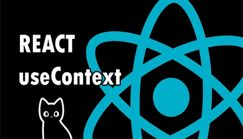

## Exemplo e explicação de "Context API" do React
 

🌟Olá!🌟

Este é o modelo usado no meu video de explicação do context api e useContext hook do react.

Segue o vídeo abaixo:

 
O modelo com os "boiler plates" esta na pasta <b>"src"</b> e em <b>"models"</b>

Obrigado por assistir!! 

Um abraço!

=)